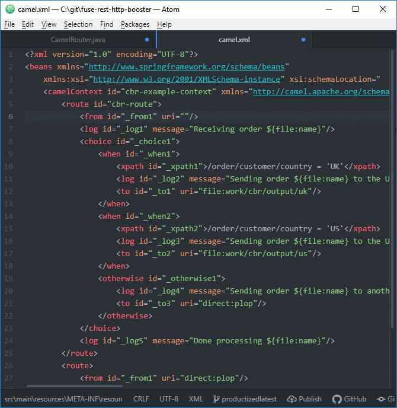
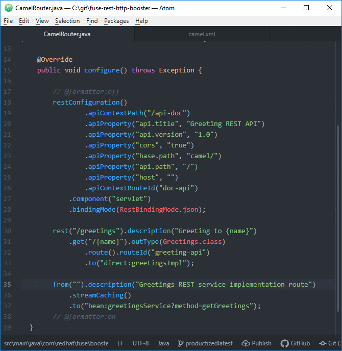

# Language Support for Apache Camel

Camel URI completion is provided for Camel Java DSL and Camel XML DSL.

Language Support for Apache Camel is based on [Language Server for Apache Camel](https://github.com/camel-tooling/camel-language-server).

# How to install

- File -> Settings
- Install
- Type "camel" in search field
- Click "Install" Button on "camel-lsp-client-atom" package
